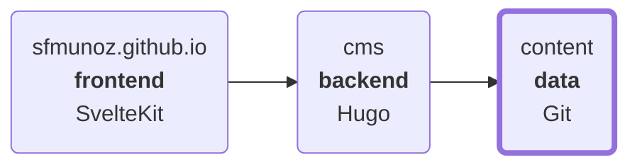

# content

> [!WARNING]
> **DO NOT EDIT**: this **README.md** file was automatically generated on **2025-08-28 16:25:04 UTC** by the **build.py** script based on the contents of the repository.

https://sfmunoz.com/ site content

## Architecture

## g

* [golang-exec-command](g/go/golang-exec-command/index.md)

## j

* [jq-examples](j/jq/jq-examples/index.md)

## l

* [lvm-snapshots](l/lv/lvm-snapshots/index.md)

## p

* [python-http-client](p/py/python-http-client/index.md)
* [python-http-server](p/py/python-http-server/index.md)
* [python-subprocess](p/py/python-subprocess/index.md)

## r

* [runc-basics](r/ru/runc-basics/index.md)
