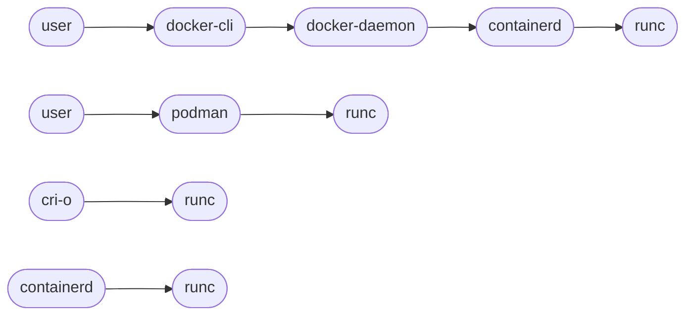

# runc

**runc** direct usage example (docker is only used to pull the image)

- [Reference](https://gist.github.com/sfmunoz/cf6fbb060c932315bd353bf5cf280945#reference)
- [runc.sh](https://gist.github.com/sfmunoz/cf6fbb060c932315bd353bf5cf280945#runcsh)
  - [Execution](https://gist.github.com/sfmunoz/cf6fbb060c932315bd353bf5cf280945#execution)

## Reference

https://mkdev.me/posts/the-tool-that-really-runs-your-containers-deep-dive-into-runc-and-oci-specifications



## runc.sh

```bash
#!/bin/bash

SUDO="sudo -u root"
TS="$(date +%Y%d%m-%H%M%S)"
TMP="/var/tmp"  # must be absolute path
TDIR="${TMP}/runc-sh-${TS}"
IMG="busybox:1.37.0"
CONT="tmp-${TS}"
#NETNS="net-${TS}"

set -x
docker image inspect $IMG > /dev/null 2> /dev/null
RES=$?

set -e

[ $RES -ne 0 ] && docker pull $IMG

mkdir $TDIR
pushd $TDIR

mkdir rootfs

docker create --name $CONT $IMG
docker export $CONT | tar -C rootfs -xf -
docker rm $CONT
runc spec --rootless

ls -ld --color * rootfs/*

# https://github.com/opencontainers/runtime-spec/blob/main/config.md
# https://github.com/opencontainers/runtime-spec/blob/main/config-linux.md
mv config.json config.json.orig

# specific netns: '.process.args=["/bin/sh"] | .root.readonly=false | .linux.namespaces |= . + [{"type":"network","path":"/var/run/netns/'$NETNS'"}]' \
# without '["type":"network"}]' -> host network is used
jq --tab \
  '.process.args=["/bin/sh"] | .root.readonly=false | .linux.namespaces |= . + [{"type":"network"}]' \
  < config.json.orig > config.json
diff -u config.json.orig config.json && true

# Otherwise 'runc' cannot run as non-root because of the following error:
# FATA[0000] nsexec-1[264231]: failed to unshare user namespace: Operation not permitted
# FATA[0000] nsexec-0[264228]: failed to sync with stage-1: next state: Success
# ERRO[0000] runc run failed: unable to start container process: can't get final child's PID from pipe: EOF
$SUDO sysctl -w kernel.unprivileged_userns_clone=1

#$SUDO ip netns add $NETNS

# Debug
#set +e
#bash
#set -e

# use the CONT name, but it's not required
runc run $CONT

#$SUDO ip netns del $NETNS

popd
rm -rf $TDIR
```

### Execution

```
$ runc.sh 
+ docker image inspect busybox:1.37.0
+ RES=0
+ set -e
+ '[' 0 -ne 0 ']'
+ mkdir /var/tmp/runc-sh-20252106-155553
+ pushd /var/tmp/runc-sh-20252106-155553
/var/tmp/runc-sh-20252106-155553 ~
+ mkdir rootfs
+ docker create --name tmp-20252106-155553 busybox:1.37.0
c01b00d7944dbff9f09db89f4ce2cd0556f495c6ddebd3959eec20d50ef9059c
+ docker export tmp-20252106-155553
+ tar -C rootfs -xf -
+ docker rm tmp-20252106-155553
tmp-20252106-155553
+ runc spec --rootless
+ ls -ld --color config.json rootfs rootfs/bin rootfs/dev rootfs/etc rootfs/home rootfs/lib rootfs/lib64 rootfs/proc rootfs/root rootfs/sys rootfs/tmp rootfs/usr rootfs/var
-rw-------  1 sfm sfm  2578 Jun 21 15:55 config.json
drwx------ 13 sfm sfm   161 Jun 21 15:55 rootfs
drwx------  2 sfm sfm 12288 Sep 26  2024 rootfs/bin
drwx------  4 sfm sfm    43 Jun 21 15:55 rootfs/dev
drwx------  3 sfm sfm   160 Jun 21 15:55 rootfs/etc
drwx------  2 sfm sfm     6 Sep 26  2024 rootfs/home
drwx------  2 sfm sfm  4096 Sep 26  2024 rootfs/lib
lrwxrwxrwx  1 sfm sfm     3 Sep 26  2024 rootfs/lib64 -> lib
drwx------  2 sfm sfm     6 Jun 21 15:55 rootfs/proc
drwx------  2 sfm sfm     6 Sep 26  2024 rootfs/root
drwx------  2 sfm sfm     6 Jun 21 15:55 rootfs/sys
drwx------  2 sfm sfm     6 Sep 26  2024 rootfs/tmp
drwx------  4 sfm sfm    29 Sep 26  2024 rootfs/usr
drwx------  4 sfm sfm    30 Sep 26  2024 rootfs/var
+ mv config.json config.json.orig
+ jq --tab '.process.args=["/bin/sh"] | .root.readonly=false | .linux.namespaces |= . + [{"type":"network"}]'
+ diff -u config.json.orig config.json
--- config.json.orig	2025-06-21 15:55:53.733496752 +0000
+++ config.json	2025-06-21 15:55:53.749496420 +0000
@@ -7,7 +7,7 @@
 			"gid": 0
 		},
 		"args": [
-			"sh"
+			"/bin/sh"
 		],
 		"env": [
 			"PATH=/usr/local/sbin:/usr/local/bin:/usr/sbin:/usr/bin:/sbin:/bin",
@@ -42,7 +42,7 @@
 	},
 	"root": {
 		"path": "rootfs",
-		"readonly": true
+		"readonly": false
 	},
 	"hostname": "runc",
 	"mounts": [
@@ -154,6 +154,9 @@
 			},
 			{
 				"type": "user"
+			},
+			{
+				"type": "network"
 			}
 		],
 		"maskedPaths": [
@@ -176,4 +179,4 @@
 			"/proc/sysrq-trigger"
 		]
 	}
-}
\ No newline at end of file
+}
+ sudo -u root sysctl -w kernel.unprivileged_userns_clone=1
kernel.unprivileged_userns_clone = 1
+ runc run tmp-20252106-155553
/ # exit
+ popd
~
+ rm -rf /var/tmp/runc-sh-20252106-155553
```

---

#tip 5010